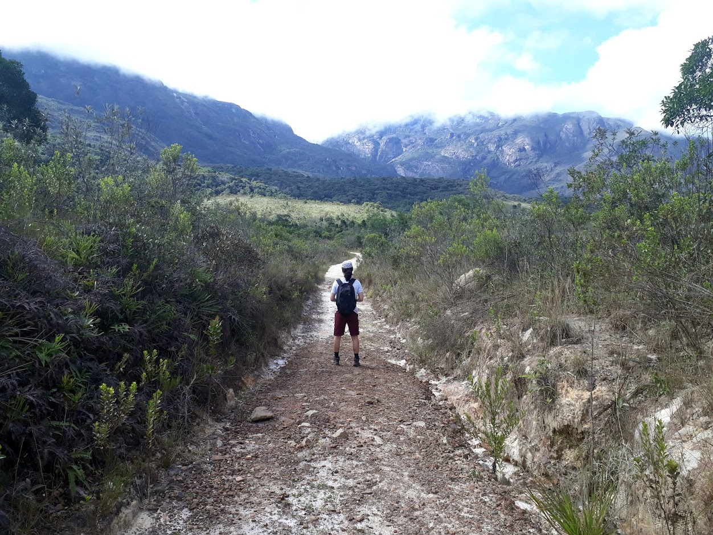

 

I have been an assistant professor at the [Department of Computer Science (DCC)](http://www.dcc.ufmg.br/) of the [Federal University of Minas Gerais (UFMG)](http://www.ufmg.br) since September 2013. DCC is one of the three CS departments in the country [ranked](http://trienal.capes.gov.br/?page_id=100) as a center of excellence by the Brazilian Government.
<!-- {style="text-align: justify;"} -->

For the whole year of 2023, I was a visiting scholar/engineer to [Inria Saclay](https://www.inria.fr/en/inria-saclay-centre) to collaborate with the team of [Prof. Catuscia Palamidessi](http://www.lix.polytechnique.fr/~catuscia/) on formal methods for responsible computing.
In the year 2019, I was a visiting professor for 5 weeks at the [School of Computing](https://researchers.mq.edu.au/en/organisations/school-of-computing) of [Macquarie University](https://researchers.mq.edu.au/en/) to collaborate with the team of [Prof. Annabelle McIver](https://researchers.mq.edu.au/en/persons/annabelle-mciver) on the same topic.
<!-- {style="text-align: justify;"} -->

From January 2012 until September 2013 I was a post-doctoral researcher at the [Department of Mathematics](https://www.math.upenn.edu/) at the [University of Pennsylvania](https://www.upenn.edu/) under the supervision of [Prof. Andre Scedrov](https://www.cis.upenn.edu/~scedrov/), with funds from the Stanford Science of Cyber-security MURI. During this post-doc, I had the pleasure of maintaining a close collaboration with [Prof. Fred B. Schneider](http://www.cs.cornell.edu/fbs/) from the [Department of Computer Science](https://www.cs.cornell.edu/) at [Cornell University](https://www.cornell.edu/).
<!-- {style="text-align: justify;"} -->

I obtained a Ph.D. in Computer Science from [LIX](https://www.lix.polytechnique.fr/), [École Polytechnique](http://www.polytechnique.fr/) (France) in 2011 under the supervision of [Prof. Catuscia Palamidessi](http://www.lix.polytechnique.fr/~catuscia/), with funds from [CNRS](https://www.cnrs.fr/) and [DGA](https://www.defense.gouv.fr/dga). My dissertation on Formal Approaches to Information Hiding was a finalist of the [Prix de Thèse ParisTech 2012](https://www.espci.psl.eu/?page=article-print&id_article=4022), granted by the [Paris Institute of Technology (ParisTech)](https://paristech.fr/).
<!-- {style="text-align: justify;"} -->

I obtained an MSc. degree in Computer Science from UFMG in 2008, with a focus on Proof Theory and Logics, under the supervision of [Prof. Elaine Pimentel](https://sites.google.com/site/elainepimentel/) and the co-supervision of [Prof. Roberto Bigonha](https://homepages.dcc.ufmg.br/~bigonha/). Before that, I obtained my BSc. degree in Computer Science also from UFMG, in 2006.
<!-- {style="text-align: justify;"} -->

