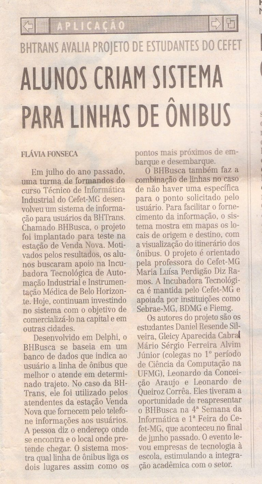

 

#### System Description

BHBusca was a software developed by a group of High School students in the year 2000 to help people find the best way to move by public transportation through the city of Belo Horizonte, Brazil. Given a source and a destination, the system computed the (combination of) bus lines one should take, together with the best stops to get on and off the buses. The system was used in the year 2000 by the [Belo Horizonte Transportation Bureau (BHTrans)](https://prefeitura.pbh.gov.br/bhtrans) in Venda Nova, a bus hub visited by more than 60,000 users a day at the time. BHBusca was the first software of this kind used by a governmental institution in Brazil.

#### Award

Best Computer Science Project of the State of Minas Gerais of the XVIII META – Minas Gerais State Technological Undergraduate and Technical High School Contest, in the year 2000.

This award was given to the best Computer Science project of all Technological Undergraduate Universities and Technical High Schools in the State of Minas Gerais. The award is given by the [Federal Center of Technological Education of Minas Gerais (CEFET-MG)](https://www.cefetmg.br/) and there are four categories of projects: Didaditc, Constructive, Research, and Software. In the XVIII META, in 2000, there were 95 projects enrolled, and BHUSca was the winner in the Software category and it won as well the best project over all categories. The system's authors were Daniel R. Silveira, Gleicy A. Cabral, Leonardo C. Araujo, Leonardo Q. Corrêa, and Mário S. Alvim.

